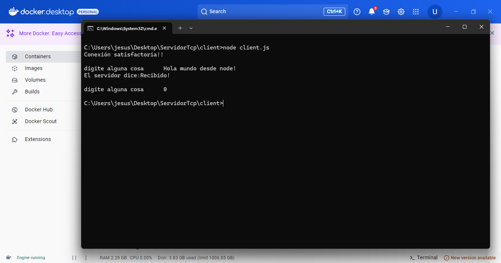
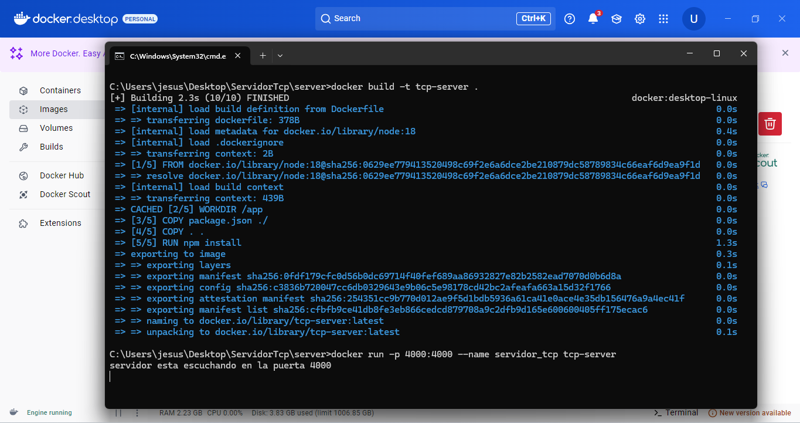

# Servidor TCP con Node.js

## Introducción
Este proyecto demuestro cómo crear un servidor y un cliente TCP utilizando Node.js. Permite el envío y recepción de mensajes entre un cliente y un servidor a través del protocolo TCP.

## ¿Qué es TCP?
El **Protocolo de Control de Transmisión (TCP)** es un protocolo de comunicación confiable que permite la transferencia de datos entre dispositivos en una red. 


## Funcionamiento del Código

### Cliente (`cliente.js`)
- Se conecta al servidor en `127.0.0.1:4000`.
- Solicita al usuario ingresar datos mediante `readline-sync`.
- Envía los datos al servidor y espera respuesta.
- Si el usuario introduce `0`, la conexión se cierra.

### Servidor (`server.js`)
- Escucha conexiones en el puerto `4000`.
- Recibe datos de los clientes y los muestra en la consola.
- Responde con un mensaje de confirmación (`Recibido!`).
- Maneja eventos de cierre y errores.

## Uso del Dockerfile

Para ejecutar el servidor en un contenedor Docker, sigue estos pasos:
1. **Construir la imagen**:
    ```bash
    docker build -t tcp-server .
    ```
2. **Ejecutar el contenedor**:
    ```bash
    docker run -p 4000:4000 tcp-server
    ```

## Ejemplo de Uso

1. Iniciar el servidor TCP:
    ```bash
    node server/server.js
    ```
2. Iniciar el cliente TCP:
    ```bash
    node client/cliente.js
    ```
3. Ingresar mensajes en el cliente y ver la respuesta del servidor.

## Imágenes del Proyecto

### Cliente ejecutándose:


### Servidor recibiendo datos:



